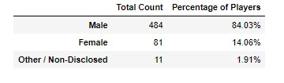
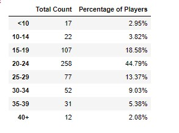
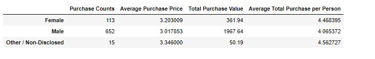
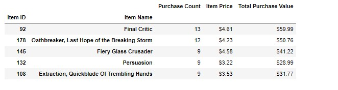

# Pandas Homework
## Heroes of Pymoli

The task of analyzing the data for their most recent fantasy game Heroes of Pymoli.

The game is free-to-play, but players are encouraged to purchase optional items that enhance their playing experience. As a first task, the company would like you to generate a report that breaks down the game's purchasing data into meaningful insights.

Listed below is the Data Frame of the data

  

### Gender Demographics

The gender for male players is significantly higher than female (84%, 14% respectively).



### Age Demographics

The largest age demographics shows that 258 or 44.8% of the players are 20-24 years old, followed by 107 or 18.6% are 15-19 years old.  



### Purchase Analysis Gender

The purchase analysis by genders shows that the female player's average purchase is higher than the male counterpart by 40 cents and the non-disclosed is higher than female by 10 cents.   



### Most Popular Items and Most Profitable Items

The most popular item was also the most profitable. It was the Final Critic a total of 13 sold for a value of $59.99
CODE:

```python
mpi_df = pd.DataFrame({"Purchase Count" :mpi_purch_count,
                     "Item Price" :mpi_avg_item,
                     "Total Purchase Value" :mpi_tot_price,})
mpi_df = mpi_df.sort_values(by='Purchase Count', ascending=False)
mpi_df['Item Price'] = mpi_df['Item Price'].map("${:.2f}".format)
mpi_df['Total Purchase Value'] = mpi_df['Total Purchase Value'].map("${:.2f}".format)
mpi_df.head()

```
